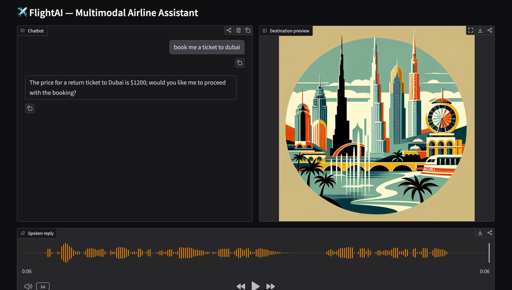

# FlightAI — Multimodal Airline Customer-Support Assistant

A conversational AI agent for a fictional airline ("FlightAI") that combines text, vision, and voice into a single Gradio app. Built on the OpenAI API with function calling for structured tool use.



## Features

- **Conversational chat** — `gpt-4.1-mini` with a domain-specific system prompt
- **Function / tool calling** — the model invokes a `get_ticket_price` tool that queries a local SQLite database
- **Image generation** — `dall-e-3` renders a pop-art destination preview when a city is mentioned
- **Text-to-speech** — `gpt-4o-mini-tts` speaks the assistant's reply aloud
- **Custom UI** — Gradio `Blocks` layout wires chat, image, and audio outputs to a single agentic loop

## Architecture

```
user message ──► Gradio Blocks
                    │
                    ▼
            chat()  ──► OpenAI chat.completions (with tools)
                    │           │
                    │           └─► get_ticket_price(city)  ──► SQLite (prices.db)
                    │
                    ├─► talker(reply)  ──► OpenAI TTS  ──► audio out
                    └─► artist(city)   ──► DALL·E 3   ──► image out
```

The chat loop keeps calling the model while it returns `finish_reason == "tool_calls"`, so multi-step tool use works automatically.

## Quickstart

```bash
# 1. Install
python -m venv .venv
source .venv/bin/activate
pip install -r requirements.txt

# 2. Configure
cp .env.example .env
# edit .env and add your OPENAI_API_KEY

# 3. Seed the price database
python init_db.py

# 4. Run
python app.py
```

The app launches at `http://127.0.0.1:7860`. Try asking *"How much is a ticket to Tokyo?"* — you'll see a pop-art preview of Tokyo, hear the assistant's reply, and read the answer in the chat.

## Project layout

| File | Purpose |
|------|---------|
| `app.py` | Gradio UI + agentic chat loop + tool / image / audio calls |
| `init_db.py` | Creates and seeds `prices.db` |
| `requirements.txt` | Python dependencies |
| `.env.example` | Template for the OpenAI API key |

## Tech stack

Python · OpenAI API (Chat Completions, Images, Audio) · Gradio · SQLite · Pillow · python-dotenv
